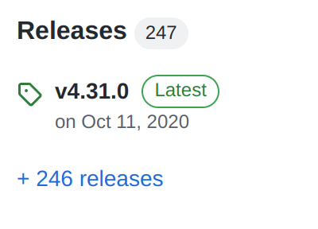
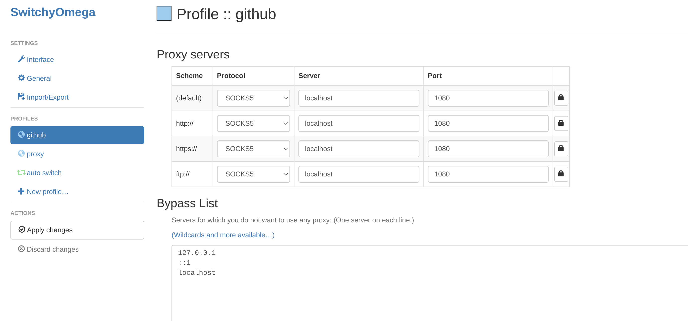
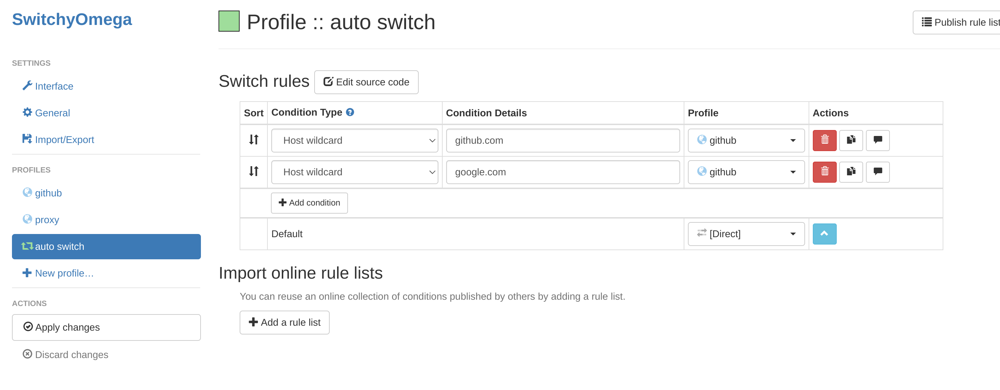

# 国内访问github教程
国内因为防火墙的原因，访问github并不稳定  
本教程记录下利用v2ray默认配置稳定访问github的其中一种方法，当然v2ray还有更多其他强大的功能，如访问google等自行摸索  
# v2ray
使用[v2ray](https://github.com/v2ray/v2ray-core)及其默认配置即可访问github
## 下载v2ray
点击上方github链接在右方找到，  
点击并在新的页面点击Download的链接进入项目的tag目录  
选择自己的平台及版本进行下载
## v2ray使用
将下载好的zip文件解压，运行v2ray文件，v2ray将自动读取目录下，config.json文件运行；  
默认配置为127.0.0.1:1080端口运行代理服务器并使用sock5协议  
v2ray的默认配置已支持github的访问与推送，以后要访问github保持v2ray处于运行状态即可


详细使用方法参见[中文教程](https://selierlin.github.io/v2ray/)
# git配置
git采用ssh协议，因此配置将在ssh上进行
`vim ~/.ssh/config`
写入以下内容:  
```config
Host github.com
    User git
    ProxyCommand nc -X 5 -x 127.0.0.1:7891 %h %p
```
即可针对github仓库进行代理
[参考文档](https://ericclose.github.io/git-proxy-config.html)
# 浏览器端
进行代理设置，推荐使用[SwitchOmega插件](https://github.com/FelisCatus/SwitchyOmega/releases)，下载crx文件即可

插件安装[参见](./chromeUse.md/#插件安装)插件安装章节  

点击插件，在插件中新建配置如下图:


并使用自动切换模式，自动切换配置如下：

